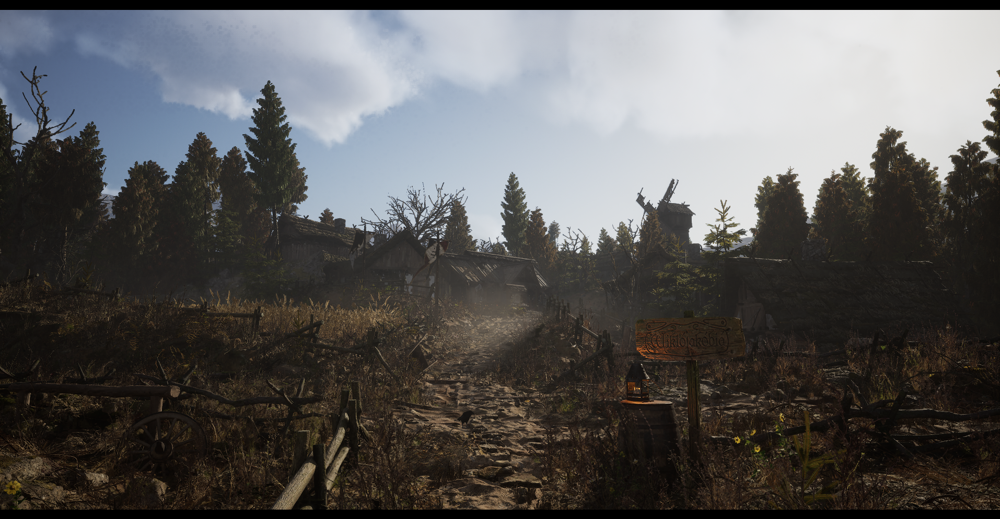
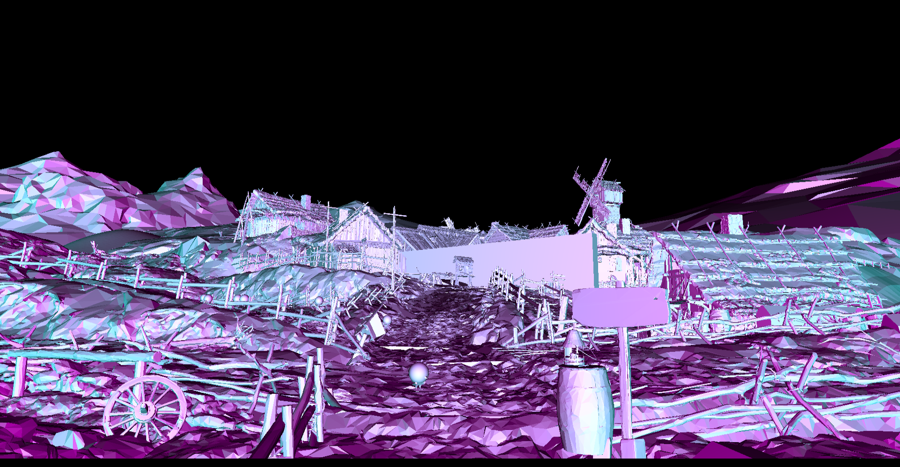
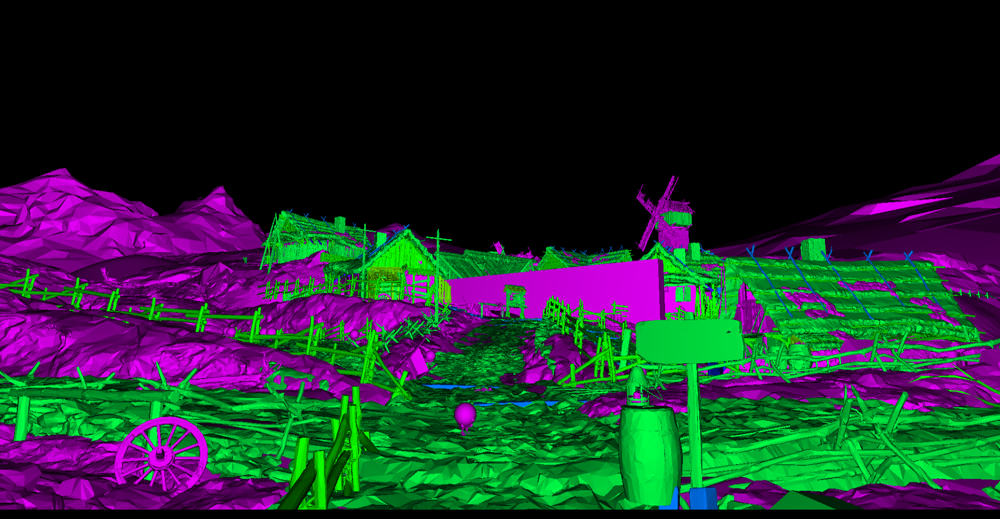
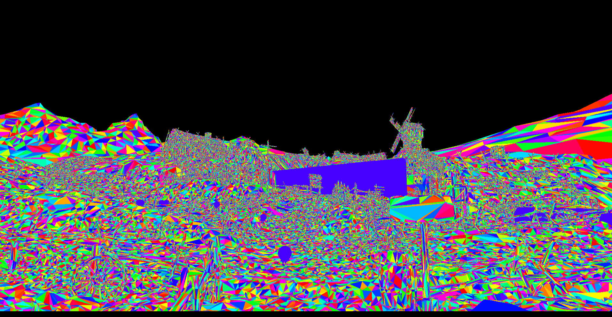
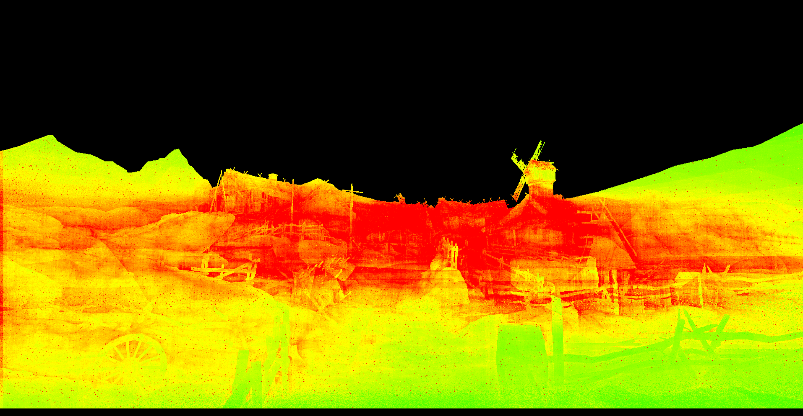
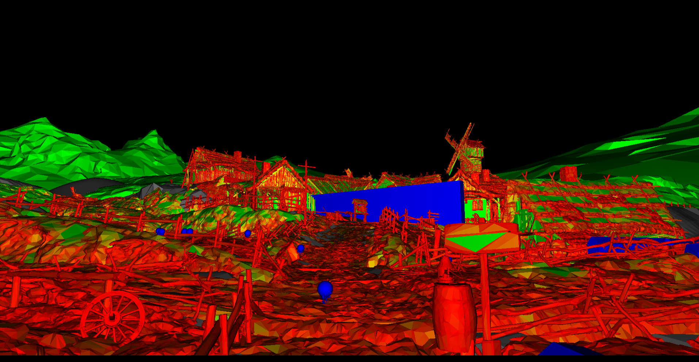
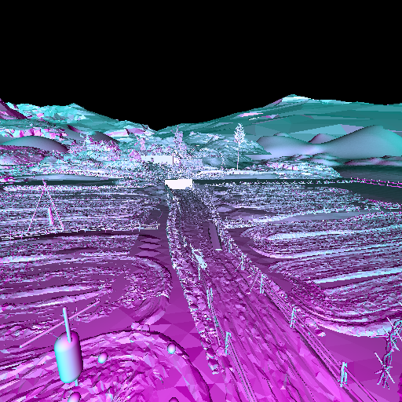
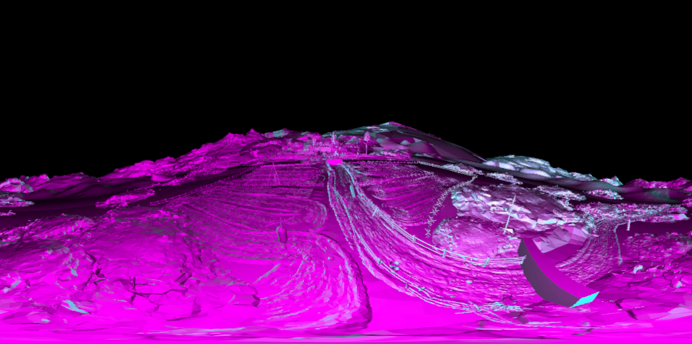

# SDCollisionVis

1. [Quick Start](#quick-start)
2. [Settings](#settings)
    * [VisMode](#vismode)
    * [Min Ray Length](#min-ray-length)
    * [TileSize and Scale](#tilesize-and-scale)
    * [FCollisionObjectQueryParams](#fcollisionobjectqueryparams)
    * [FCollisionQueryParams](#fcollisionqueryparams)
3. [Offline Rendering](#offline-rendering)
    * [Server Debugging](#server-debugging)

<hr/>

SDCollisionVis is a plugin for UnrealEngine to help see the actual state of the scene, as Chaos sees it.
The collision viewmodes that come with Unreal only draw the rendering mesh, not the physics mesh.
Using `LineTraceSingleByObjectType`, we can raytrace the physics scene directly and build a better image of what's going on.


[](./img/medieval_ref.png)<br>Reference ([MedievalGame](https://www.unrealengine.com/marketplace/en-US/product/scarecrow))

<br>

[](./img/medieval_vis0.png)<br>Facing Ratio

<br>

[](./img/medieval_vis1.png)<br>Primitive ID

<br>

[](./img/medieval_vis2.png)<br>Triangle ID

<br>

[](./img/medieval_vis3.png)<br>Material ID

<br>

[](./img/medieval_vis4.png)<br>Raytracing Time

<br>

[](./img/medieval_vis5.png)<br>Triangle Density

<br>

## **Quick Start**

If you're in editor, you can very quickly enable the realtime overlay by toggling on this visualisation mode.

[](./img/enable_realtime_editor.png)


In a cooked build, you can instead toggle it on with:
```
show SDCollisionVis
```


## **Settings**

Everything in SDCollisionVis is configured via cvars.


### **VisMode**

You can change the current visualisation mode via `r.SDCollisionVis.Settings.VisType`:

0. **Default**<br>Facing Ratio Based Thing
1. **Primitive Id**<br>Hash of `HitResult.ElementIndex`
2. **Triangle Id**<br>Hash of `HitResult.ElementIndex + HitResult.FaceIndex`
3. **Material Id**<br>Hash of `HitResult.PhysMaterial->GetUniqueID()`
4. **Raytrace Time**<br>Takes the time difference before and after the raycast.<br>Can be configured further with:
    * `r.SDCollisionVis.Settings.RaytraceTime.IncludeMisses`
    * `r.SDCollisionVis.Settings.RaytraceTime.MinTime`
    * `r.SDCollisionVis.Settings.RaytraceTime.MaxTime`
5. **Triangle Density**<br>Attempts to extract a triangle from the underlying physics mesh and computes its' area.<br>Can be configured further with:
    * `r.SDCollisionVis.Settings.TriangleDensity.MinArea`
    * `r.SDCollisionVis.Settings.TriangleDensity.MaxArea`


### **Min Ray Length**

If you're playing a first person game, it's very likely the character's capsule will occlude the entire screen.

For cases like that, there is:

`r.SDCollisionVis.Settings.MinDistance`<br>Defaults to 100.


### **TileSize and Scale**

In order to keep things from turning your experience into a full on slide show, the realtime renderer cuts up the screen into tiles and will only evaluate one pixel of that tile per frame.

You can configure this with:

`r.SDCollisionVis.Settings.TileSize`<br>Defaults to 8, and clamped between 2 (2x2) and 128 (128x128).

<br>

Additionally, the framebuffer can be scaled, so less pixels overall need to be evaluated.

`r.SDCollisionVis.Settings.Scale`<br>Defaults to 0.5

<br>

The defaults were chosen based upon running things at 3840x2160 and prioritising image clarity.

If you want a very rapid update, like if you want to walk around, something like this might be a good option:

```
r.SDCollisionVis.Settings.Scale 0.25
r.SDCollisionVis.Settings.TileSize 2
```


### **FCollisionObjectQueryParams**

The object query params are configured under `r.SDCollisionVis.CollisionObjectQuery.*`:
* `AllObjects`
* `AllStaticObjects`
* `AllDynamicObjects`
* `WorldStatic`
* `WorldDynamic`
* `Pawn`
* `Visibility`
* `Camera`
* `PhysicsBody`
* `Vehicle`
* `Destructible`

### **FCollisionQueryParams**

The query params are configured under `r.SDCollisionVis.CollisionQuery.*`:
* `TraceTag`
* `TraceComplex`
* `IgnoreBlocks`
* `IgnoreTouches`
* `MobilityType`

### **Presets**

If you mess up, you can reset `FCollisionObjectQueryParams` and `FCollisionQueryParams` with:
```
r.SDCollisionVis.Preset.Default()
```

## **Offline Rendering**

If you want a higher quality offline render, there is:

```
r.SDCollisionVis.OfflineRender()

Args:
    -resolution         : Resolution to use. (Default: 512)
    -max-rays-per-frame : Number of rays to dispatch per frame. (Default: 1024)
    -cubemap            : Render as a CubeMap. (Default: false)
    -player-controller  : Player controller for fetching transform info. (Default: 0)
```

e.g:
> `r.SDCollisionVis.OfflineRender() -cubemap -resolution=2048`

The output will go  into: Saved/SDCollisionVis, with a .png for normal and a .dds for cubemaps.
The FOV is always fixed to 90deg for none cubemap.

[](./img/medieval_offline.png)<br>Offline

<br>

[](./img/medieval_offline_cubemap.png)<br>Offline Cubemap

<br>

### **Server Debugging**

If in PIE, in the same process, you can redirect the realtime renderer to use the servers world.
```
r.SDCollisionVis.Settings.UseServerWorld 1
```

Otherwise you can use `serverexec`.

```
serverexec r.SDCollsionVis.Settings.VisType 2
serverexec r.SDCollisionVis.OfflineRender() -cubemap -resolution=2048
```

And it will have to be manually copied from the server.
